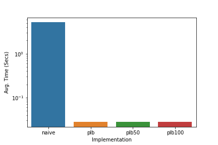

# l2-orderbook-tops

  

Extract TOPS (top N best bid & best ask prices and sizes) from L2 orderbook data. 

Optionally sum total bid and ask sizes within specified dollar amount of the mid price at each tick.

See [Example Usage Notebook](docs/example_usage.ipynb) for usage.

## Technology

Python, Numpy, Cython, C++

## Design decisions

Makes use of libstdc++::set to order L2 price levels on insertion for efficient querying (red-black trees).

Prices and order sizes are stored as unsigned integers for efficient storage in memory. The maximum value is 4,294,967,295 which means the maximum value of an order price in this implementation is $42,949,672.95 (*100) and the maximum value for an order size is 4,294,967.295 (*1000). 

## Benchmarks

The basic l2-orderbook-tops implementation runs ~114x faster then the naive Python implementation on a sample of 100,000 L2 price level updates. When also tracking the qty of the closest $50 and $100 worth of orders from the mid price, this improvement decreases to 15x and 8x respectively.

See [Benchmark Notebook](docs/benchmarks.ipynb) for details.
